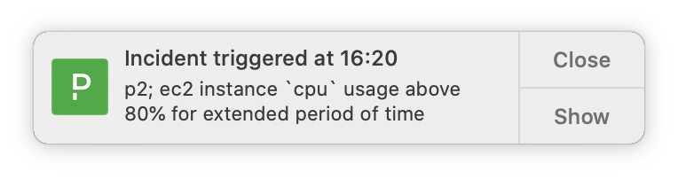

# PagerDuty Notifier



PagerDuty Notifier polls the PagerDuty api for new incidents and sends native Mac OS notifications.
You can control the notification style as you normally would in _System Preference_

PagerDuty Notifier is written in go-lang and should run natively on Mac OS, Windows and Linux
although the author is running Mac OS so all development and test is only focused on that OS.
You are more than welcome to test this on Windows and Linux and do pull-request.

## Configuration file

PagerDuty Notifier requires a configuration file _.pagerduty.ini_ in your HOME directory.
If one does not exist, a default one will be generated for you (Currently only on Mac OS).
You will need to edit it and insert a valid token from PagerDuty.  
Create your token here: https://&lt;your-company&gt;.pagerduty.com/api_keys

Example configuration file (which is the default one you will get the first time you run the notifier.):

```
[main]
# default timezone is UTC
timezone = Europe/Copenhagen
# default pause timeout is "0", which is no timeout
pause.timeout = 60
# clear.on.unpause defines if notifier should clear last timestamp and start notifying from unpause time.
clear.on.unpause = false

[pagerduty]
# You need to add your Pagerduty API token
token = your-secret-token-here
# default interval between poll's is 30 sec.
interval = 30

# set title of incident notification, use golang text/template references to
# "github.com/PagerDuty/go-pagerduty/incident.go" Incident struct
title = "Incident {{.Status}} at {{.CreatedAt | format}} ({{.Service.Summary}})"

# Optional query parameters for the Pagerduty API
# Use comma separated lists of names (for users also email). You will usually only use one of them.
# If left blank, you will receive all incidents from the account.
teams =
users =
services =

# include and exclude filters is applied (in that order) to all incidents coming from PD API
# with the above query parameters.

# Format is "<property.[!]name> = <incident filter>"" where:
#    <property> is one of "team" or "service"
#    <name> which team or service this filter should be applied
#           optionally the <name> could be prefixed with [!] to indicate the oppersite match
#    <incident filter> regular expression to match the title of the incident
#
# if no include filters is defined, default is to include every incident


# This will include incidents from all services except the "test" service
[include]
service.!test = .*

# This will exclude all incidents to "devops" team that matches ".*test.*"
[exclude]
team.devops = .*test.*
```

As you can see from the example configuration file, the notifier operates with three levels of 'filters'

1. First you can choose to query the PagerDuty API to only retrieve alerts for specific users, teams or services.
   - All three query parameters is a comma separated list of names.
   - For users, you can choose between user name or email.
   - If you leave all three empty, you we receive every alert from the account.
2. Secondly you have a set of include filters, to only include certain alerts. Filters can be set per team/service.
   - If no include filters have been defined, the default will be to include every alert.
3. Thirdly you have a set of exclude filters, to exclude specific alerts. These can also be set per team/service.

Looking in your HOME directory, apart from the configuration file, you will also find a timestamp file _.pagerduty.ts_
with the time of last seen alert. This is to make sure that you will be notified about all alerts, even if your laptop have been sleeping for a while.

## Future features

- Chose between multiple pause intervals from menu
- Acknowledge an alert directly from the notification.
- Overview of alerts from today in menu
